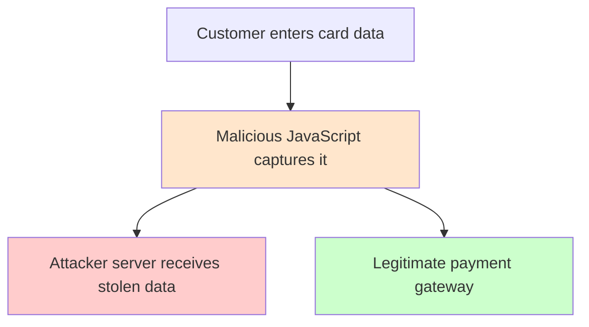
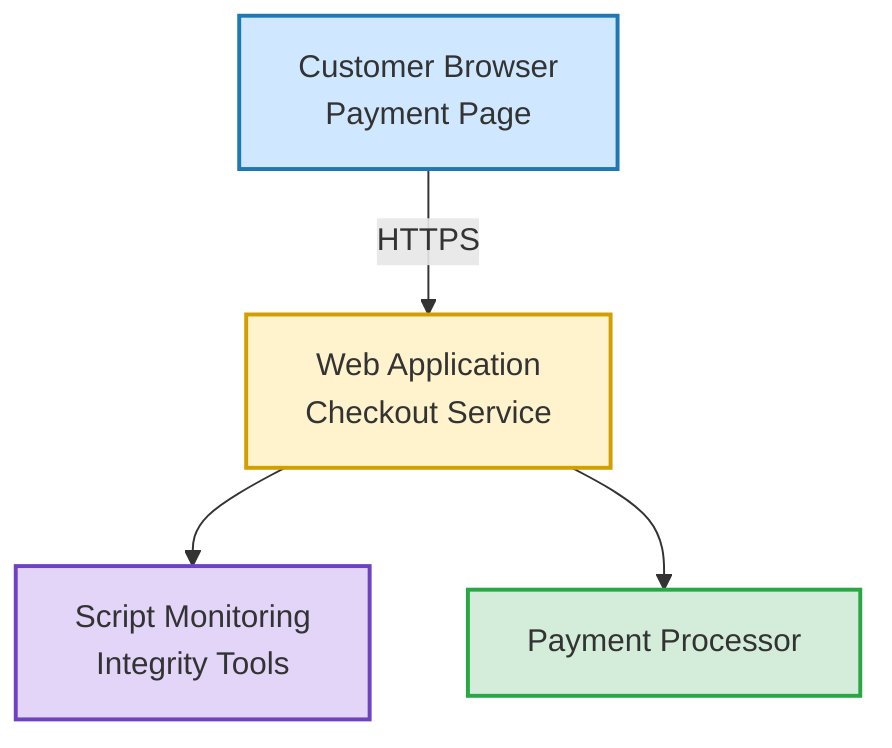

# Securing the Browser Payment Page: Understanding PCI DSS 4.0 Requirement 6.4.3  
## Protecting cardholder data from malicious JavaScript and client-side attacks

Estimated reading time: **6 minutes**
---

Estimated reading time: **6 minutes**

| 🧭 Article Navigation | ⚡ TL;DR |
|---|---|
| • [The Risk: JavaScript Skimming Attacks](#the-risk-javascript-skimming-attacks) <br> • [What PCI DSS 6.4.3 Requires](#what-pci-dss-643-requires) <br> • [Payment Page Protection Architecture](#a-clean-architecture-for-payment-page-protection) <br> • [Key Security Controls Explained](#key-security-controls-explained) <br> • [Why This Matters](#why-this-matters) <br> • [Final Thoughts](#final-thoughts) | To protect payment pages under **PCI DSS 4.0 Requirement 6.4.3**: <br><br> • Control which scripts can run on payment pages <br> • Enforce browser security policies such as **CSP** and **SRI** <br> • Continuously monitor for unauthorized script changes <br><br> These controls help prevent malicious JavaScript from stealing cardholder data in the browser. |

---

When a customer enters credit card information on a website, we might assume most of the risk lies in the backend systems.

In reality, **[One of the most dangerous places for payment data is the customer’s browser itself](https://jscrambler.com/blog/battle-for-payment-card-data)**.

Modern payment pages rely on JavaScript libraries, APIs, analytics scripts, and third-party integrations. If any of these scripts are compromised, attackers can silently capture cardholder data before it is even transmitted to the payment processor.

This is exactly the problem **PCI DSS 4.0 Requirement 6.4.3** is designed to address.

---

## What We Will Learn

In this article, we will explore:

- Why browser-based payment pages are vulnerable  
- What **PCI DSS 6.4.3** requires  
- A clean architecture model for protecting payment pages  
- Key security controls organizations should implement  

---

# The Risk: JavaScript Skimming Attacks

One of the most common attacks against e-commerce systems is JavaScript skimming attacks such as [Magecart](https://en.wikipedia.org/wiki/Magecart) which inject malicious scripts into checkout pages to steal payment information entered by users.

In these attacks, malicious JavaScript is injected into a payment page and secretly captures sensitive information such as:

- Primary Account Number (PAN)  
- Card expiration date  
- CVV  

The attack happens **directly inside the browser**.

The user sees a normal checkout page, but a hidden script silently sends card data to an attacker-controlled server.

### Example Attack Flow



Because the transaction still succeeds, organizations may not notice the compromise for months.

---

# What PCI DSS 6.4.3 Requires

PCI DSS 4.0 introduced new controls specifically focused on **scripts running on payment pages**.

Organizations must:

- Maintain an inventory of scripts on payment pages  
- Authorize scripts that are allowed to run  
- Verify script integrity  

### The goal is simple

> Prevent unauthorized or modified scripts from executing in a customer’s browser.

---

# A Clean Architecture for Payment Page Protection

A secure payment page architecture typically combines:

- Browser security controls  
- Server-side governance  
- Monitoring and detection capabilities  

Below is a simplified architecture model organizations can use to meet PCI DSS requirements.



This **layered approach** helps protect payment pages against unauthorized script execution.

---

# Key Security Controls Explained

## 1. Content Security Policy (CSP)

A **[Content Security Policy (CSP)](https://developer.mozilla.org/en-US/docs/Web/HTTP/CSP)** is a browser security mechanism that restricts where scripts can be loaded from.

### Example

```http
Content-Security-Policy:
script-src 'self' https://trusted-cdn.com
connect-src https://payment-api.company.com
```

This prevents:

- Malicious script injections
- Unauthorized third-party resources
- Data exfiltration to attacker domains

## 2. Subresource Integrity (SRI)

**[Subresource Integrity (SRI)](https://developer.mozilla.org/en-US/docs/Web/Security/Subresource_Integrity)** ensures that external scripts have not been modified.

### Example
```http
<script src="https://cdn.example.com/library.js"
integrity="sha384-oqVuAfXRKap7fdgcCY5uykM6+R9GqQ8K..."
crossorigin="anonymous">
</script>
```

If the script content changes, the browser blocks it.

This is particularly important when using CDN-hosted libraries.

## 3. Script Inventory and Authorization

Organizations must maintain a documented inventory of all scripts used on payment pages, including:

- First-party scripts
- Third-party libraries
- Analytics tools
- Tag managers
- Each script should be:
- Approved
- Tracked
- Periodically reviewed

This helps detect unauthorized additions.

## 4. Payment Page Monitoring

PCI DSS Requirement 11.6.1 complements Requirement 6.4.3 by requiring detection of unauthorized changes to payment pages.

This may include:

- Page integrity monitoring
- Script change detection
- Alerting on unauthorized modifications
- Several security platforms provide these capabilities.

---
Why This Matters
---

Historically, many organizations focused their PCI security controls on backend systems.

However, modern attacks increasingly target client-side code running in the browser.

PCI DSS 4.0 reflects this shift by emphasizing controls that protect the payment page itself.

By implementing controls such as:

- Content Security Policy
- Subresource Integrity
- Script monitoring
- Page integrity validation

organizations can significantly reduce the risk of browser-based card data theft.

---
Final Thoughts
---

Protecting payment pages is no longer optional. As attackers increasingly target browser-based environments, organizations must adopt security controls that extend beyond traditional server-side protections.

PCI DSS Requirement 6.4.3 encourages a layered approach that combines:

- Script governance
- Browser security policies
- Continuous monitoring

When implemented correctly, these controls help ensure that the payment page customers trust remains secure.

---